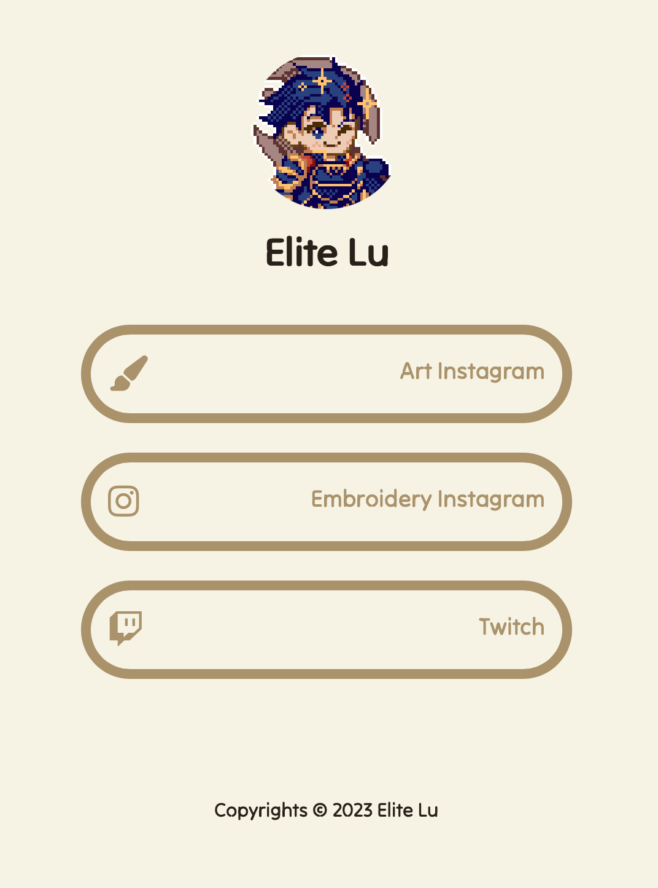
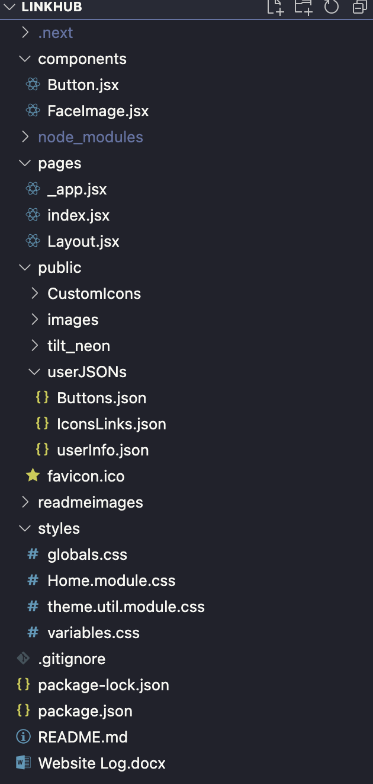

  

# LinkHub

## About

This is a project is a pocket sized version of LinkTree. It allows for users to easily create their own link consolidation hub for social media such as Instagram, X (Formerly Twitter), and Facebook to list a few.

## How to Use

Currently, this project is being used to host my own links, which include my two art Instagram accounts and my Twitch account. However, this project can be easily modified to fit your uses.

### Folder Layout

The only files that basic user modification is needed are the following:

- "Buttons.json": A file that contains all the buttons that the user wants on their LinkHub

- "IconsLinks.json": A file to icons that are used from the FontAwesome Library (free version)

- "userInfo.json": A file to the user's information.

- "CustomIcons": A folder to put all custom SVG icons that are not present in the FontAwesome Library

## FAQ

### Why use this over LinkTree?

This is an ad free application that does not have a watermark. This application will remain free and have no hidden costs. In addition to this, for developers who want to add additional fields and change the design, this project provides a skeleton for a link consolidation platform.
